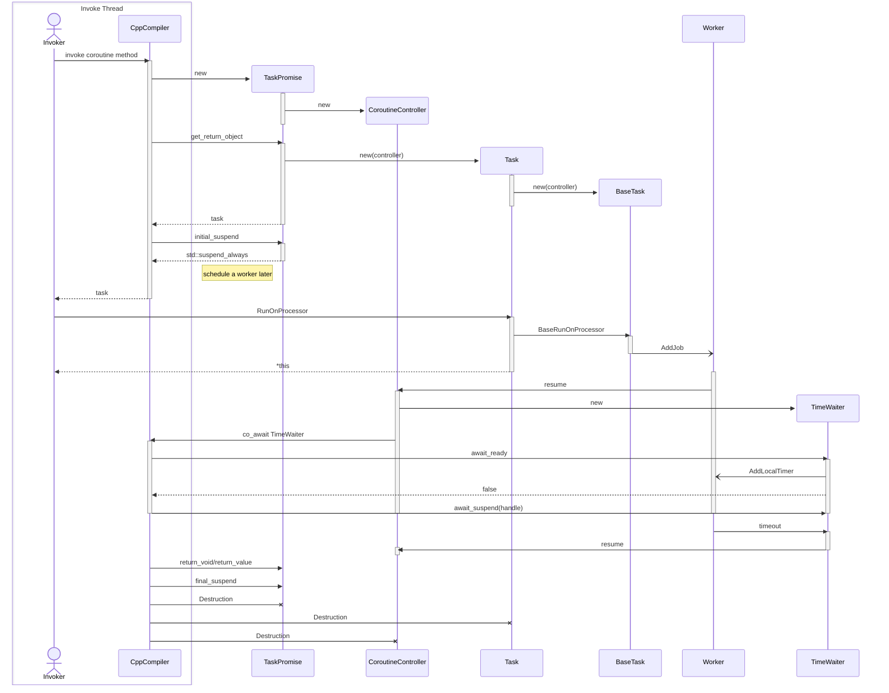

告一段落了, 记一记
# cpp协程

一般异步任务需要把相关变量记在一个类似临时session的地方, 影响效率,看看协程能否简化这部分处理.

* 任务式
* 多线程

# 大概的样子
详见[coroutines_cpp_mt_tests.cpp](https://github.com/noodle1983/coroutines-cpp-mt/blob/main/test/src/coroutines_cpp_mt_tests.cpp)

## 线程模型初始化
### 定义worker组
```
// usage 1 : define worker group(thread model)
// NOLINTNEXTLINE
namespace WorkerGroup {
enum {
    BG1 = 0,
    BG2 = 1,
    //...

    MAX,
};

```
### 主线程里(main函数)初始化
```
	nd::Worker::MarkMainThread();
	g_worker_mgr->Init(WorkerGroup::MAX);
	g_worker_mgr->Start(WorkerGroup::BG1, 1, "bg1");
	g_worker_mgr->Start(WorkerGroup::BG2, 1, "bg2");
	LOG_DEBUG("worker inited!");

```


## 协程main函数里启动任务(其他协程)
```
    auto main_task = []() -> nd::Task<> {
		// bg_task start from here
		auto bg_task = []() -> nd::Task<> {
			co_await nd::TimeWaiter(1000);  // NOLINT
			LOG_TRACE("<- bg task in worker" << nd::Worker::GetCurrWorkerName() << " after 1 sec later");
			co_return;
		}();
		co_await bg_task.RunOnProcessor(WorkerGroup::BG1);

        LOG_TRACE("<- main task in worker" << nd::Worker::GetCurrWorkerName());
    }();

    main_task.RunOnProcessor();  // run on current worker, which is main worker on
                                 // the marked main thread.
    main_task.WaitInMain();
    nd::Worker::GetMainWorker()->WaitUntilEmpty();
```


## 流程图
代码例子
```
auto bg_task = []() -> nd::Task<> {
    LOG_TRACE("-> bg task in worker" << nd::Worker::GetCurrWorkerName());
    co_await nd::TimeWaiter(1000);  // NOLINT
    LOG_TRACE("<- bg task in worker" << nd::Worker::GetCurrWorkerName() << " after 1 sec later");
    co_return;
}();
co_await bg_task.RunOnProcessor(WorkerGroup::BG1);

```

执行日志：
```
2025-09-13 16:22:39.038 TRACE [main](task.hpp:221) promise-2 created
2025-09-13 16:22:39.039 TRACE [main](task.hpp:54) controller-2 created
2025-09-13 16:22:39.040 TRACE [main](task.hpp:356) promise-2 get_return_object
2025-09-13 16:22:39.040 TRACE [main](task.hpp:270) task-2 created
2025-09-13 16:22:39.041 TRACE [main](task.hpp:230) promise-2 inital_suspend
2025-09-13 16:22:39.042 TRACE [bg1](task.hpp:136) task-2 run in worker
2025-09-13 16:22:39.042 TRACE [bg1](coroutines_cpp_mt_tests.cpp:69) -> bg task in worker[bg1]
2025-09-13 16:22:40.047 TRACE [bg1](coroutines_cpp_mt_tests.cpp:71) <- bg task in worker[bg1] after 1 sec later
2025-09-13 16:22:40.066 TRACE [bg1](task.hpp:246) promise-2 return void
2025-09-13 16:22:40.067 TRACE [main](task.hpp:294) task-2 return void
2025-09-13 16:22:40.068 TRACE [bg1](task.hpp:236) promise-2 final_suspend
2025-09-13 16:22:40.070 TRACE [bg1](task.hpp:226) promise-2 destroyed
2025-09-13 16:22:40.070 TRACE [main](task.hpp:272) task-2 destroyed
2025-09-13 16:22:40.073 TRACE [main](task.hpp:61) controller-2 destroyed
```

流程图


# known issue
* lamda函数不能捕捉协程栈的对象,地址不对(VC/g++/clang最新版都有问题)
* 日志是同步的, 测试用, 不打算做进一步修改, log.h里重新定义宏去掉或者接上项目实现即可

# todo
* 上报known issue
* 协程统计监控


# Ref
* [[Eng]ExploringTheCppCoroutine.pdf](https://luncliff.github.io/coroutine/ppt/[Eng]ExploringTheCppCoroutine.pdf)
* [cmake-project-template](https://github.com/kigster/cmake-project-template)
* [Save your sanity and time — Beyond clang-format.](https://itnext.io/save-your-sanity-and-time-beyond-clang-format-2b929b9120b8)
* [pre-commit.](https://pre-commit.com/)